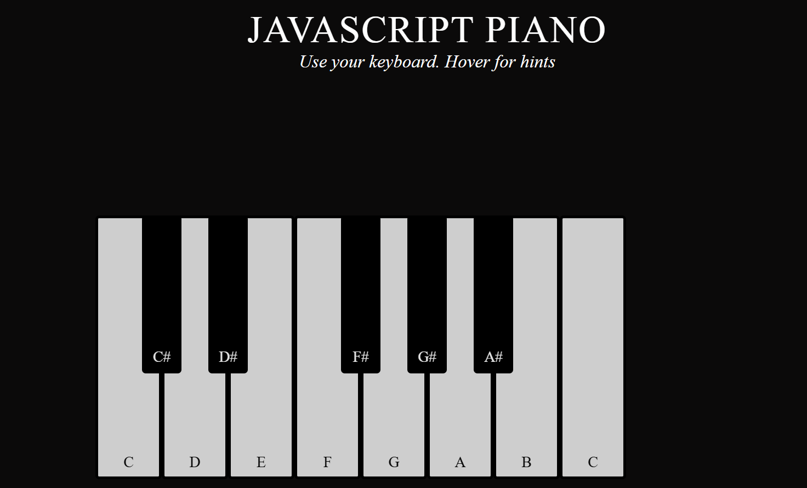

---

# Virtual Keyboard

## Overview

This project is a **virtual keyboard** created using **HTML**, **CSS**, and **JavaScript**. The keyboard allows users to interact by clicking or typing, simulating a physical keyboard on the web.

## Features

- Interactive keys that respond to user clicks and keyboard inputs.
- Visually styled keyboard using CSS for a clean, user-friendly interface.
- Real-time key press highlighting.
- Customizable layout and functionality.

## Technologies Used

- **HTML**: Used for structuring the keyboard layout.
- **CSS**: Applied for styling the keyboard, including colors, fonts, and responsive design.
- **JavaScript**: Handles the interaction logic, such as detecting key presses and clicks.

## File Structure

- `index.html`: Contains the structure of the keyboard.
- `style.css`: Styles for the keyboard layout, animations, and responsiveness.
- `script.js`: JavaScript code for handling user interaction and key events.

## Customization

- You can modify the key layout in the `index.html` file if you want to create a custom keyboard layout.
- Change colors, fonts, and animations by editing the `style.css` file.
- Extend the functionality in the `script.js` file to add more features like sound effects or keyboard shortcuts.

## Future Enhancements

- Add sound effects for key presses.
- Implement multi-language support.
  

  

    
